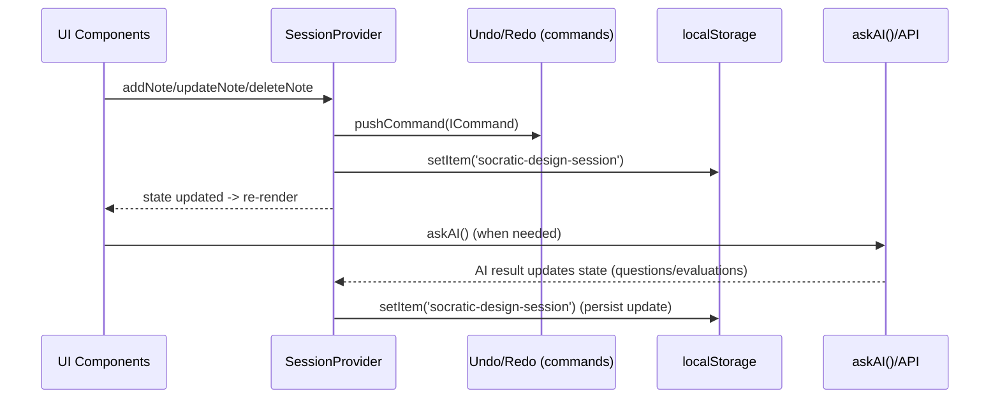
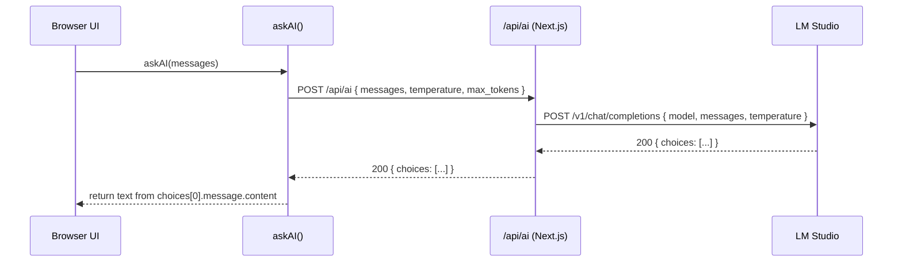
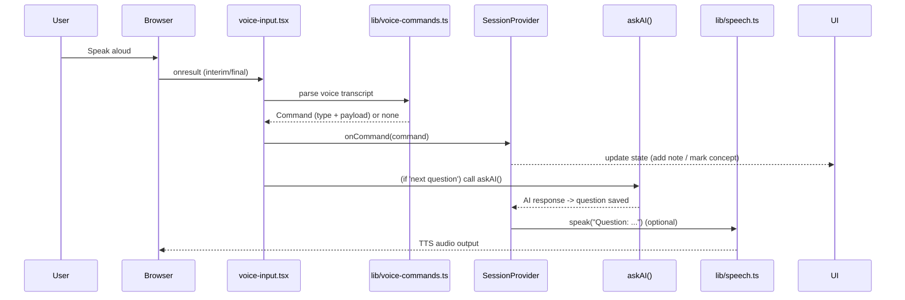

# Socratic Design Studio — Technical Architecture

Hi — I wrote this overview and technical description in first-person terms to explain how the app works to both non-technical people and engineers who want to dig in. I’ll walk through the main features, how they work under the hood, and how the AI and voice features are implemented.

---

## Table of Contents

- Overview
- Core Ideas & Tech Stack
- App Structure & Pages
- Data Model & State Flow
  - State change & persistence diagram
- AI Integration (Client, Server, LM Studio)
  - AI request sequence diagram
- Voice Input & Speech Synthesis
  - Voice flow diagram
- Drag & Drop Canvas, Notes, Drawings & Images
- Undo / Redo & Commands
- Session Persistence
- PDF Export / Finalization
- Image Handling & Compression
- How to Run Locally & Environment Variables
- Troubleshooting & Common Issues
- Appendix: Key Files & Code References

---

## Diagram Legend & Accessibility

I added several Mermaid sequence diagrams in this document to illustrate the most important flows. If your markdown viewer does not render Mermaid diagrams, each diagram is followed by a short textual explanation that summarizes the flow so screen readers and plain text viewers can still read it.

Mermaid notes:

- These are sequence diagrams (showing who calls who and the order of messages).
- Primary actors include: Browser UI, `askAI()` client, `app/api/ai` server endpoint (Next.js route), LM Studio (local model), `SessionProvider`, localStorage, and the voice/TTS helpers.

If you prefer PNG/SVG images instead of Mermaid text diagrams, I can export and add them to the docs as assets.

---

## Overview

This project is an interactive ideation tool built around a design teaching approach called Socratic learning. In plain terms, the app helps people generate ideas by asking targeted, short questions and letting them capture, group, and refine ideas on a canvas.

I designed the app so all important flows are client-driven, with one central and small server route that proxies AI requests to an external or local model server (LM Studio). The app uses the browser's native Web Speech API for voice input and text-to-speech (TTS), utilities for image compression and drawing, and local storage to persist sessions.

This document explains the implementation details in an approachable way while giving explicit file references so engineers can find the code in the repo.

---

## Core Ideas & Tech Stack

- Framework: Next.js (App Router)
- Styling: Tailwind CSS
- State Management: React Context (single SessionProvider) plus localStorage persistence
- AI Integration: a small server API route (`/api/ai`) is a proxy to an LLM endpoint (LM Studio in our setup)
- Voice Input: Web Speech API (SpeechRecognition)
- Text-to-Speech: Web Speech Synthesis API
- Drawing: React Sketch Canvas
- PDF generation: `@react-pdf/renderer` for client-side PDF export

Key code files are listed in the Appendix.

---

## App Structure & Pages

At a glance the important application pages and features are:

- Landing/HMW: `app/page.tsx` — the start of a session where the user enters a "How Might We" challenge.
- Canvas (ideation): `app/canvas/page.tsx` — the main working area with sticky notes, sketches, and controls.
- Journey / AI Panel: `app/journey/page.tsx` and `components/ai-question-panel.tsx` — the AI side-panel that generates Socratic questions and voice interactions.
- Select & Refine: `app/select/page.tsx` & `app/refine/page.tsx` — selecting and refining concepts.
- Final: `app/final/page.tsx` — generate PDF export and finalize.
- AI API proxy: `app/api/ai/route.ts` — server-side route used to send requests to LM Studio.

The UI components that handle the major interactions include `components/sticky-note.tsx`, `components/drawing-canvas.tsx`, `components/voice-input.tsx`, and `components/ai-question-panel.tsx`.

---

## Data Model & State Flow

I use a single `SessionProvider` React context (`lib/session-context.tsx`) to keep the user session state in one place. This makes the app seamless to use and easy to synchronize between UI components.

Important shapes:

- `SessionState` (in `lib/types.ts`) contains: projectId, HMW statement, notes, questions, concepts, evaluations, current phase, viewport, voiceMode flags, and more.
- `StickyNote` stores note text, location, color, image attachments, drawing data, and metadata.
- `AIQuestion` describes the questions generated by the model.

Flow examples:

- User writes a sticky note → `addNote()` on session context: adds a new `StickyNote` object and updates the state.
- User marks a note as a concept → `updateNote()` modifies `isConcept` and possibly opens detail modal.
- UI shows lists and counts (like number of unanswered questions) directly from `SessionState`.

Every change is persisted to localStorage under the key `socratic-design-session` so sessions survive reloads.

### State Change & Persistence Diagram



Description: This diagram shows how UI actions are routed through the `SessionProvider`, recorded via the command stack for undo/redo, and persisted to `localStorage` so the app can restore state across reloads.

---

## AI Integration

The AI flow is intentionally simple: a client function sends user input to a local server route that forwards the request to LM Studio (or another LLM API).

High level flow:

1. A client function `askAI()` in `lib/ai-client.ts` builds a payload and POSTs to `/api/ai`.
2. The server route at `app/api/ai/route.ts` accepts the JSON body, builds a request object expected by the LM Studio model, and POSTs it to LM Studio using `fetch()`.
3. The LM Studio server returns the completion; we pass it back to the client.
4. The client updates state and UI (new AI question, evaluations, or other results).

### AI Sequence Diagram



The sequence above shows how the front-end calls `askAI()` to send messages into the controlled server API; the server forwards these to the LM Studio model and returns the model reply to the client for UI updates.

The system prompt used to enforce Socratic behavior is `SOCRATIC_SYSTEM_PROMPT` in `lib/ai-client.ts`. The app constructs a conversation context string using `buildConversationContext()` and adds the prompt and recent conversation notes to the request, which helps the model ask context-aware follow-ups.

Implementation details:

- `askAI()` handles the client-side POST and parses the JSON response.
- The `POST` route (`app/api/ai/route.ts`) reads environment variables `LMSTUDIO_URL`, `LMSTUDIO_INFER_PATH`, and `LMSTUDIO_MODEL` (see `README.md`) to proxy to the local AI.
- The route wraps LM Studio authentication and request shaping (we are using a minimal proxy pattern: `fetch(targetUrl, { method: 'POST', body: ...})`).
- We handle errors: if LM Studio returns an HTTP error, we wrap the details in a 500 or similar response.

Note about running LM Studio:

- The repo expects a local LM Studio instance at `http://127.0.0.1:1234` by default.
- You can override that with `LMSTUDIO_URL` in `.env.local`.

---

## Voice Input & Text-to-Speech

The app uses the Web Speech APIs in the browser to provide voice control and feedback.

Voice input flow and implementation:

- `components/voice-input.tsx` uses the browser's `SpeechRecognition` or `webkitSpeechRecognition`.
- It sets continuous listening (interim results enabled) and updates the UI with intermediate transcripts for immediate feedback.
- We parse user transcripts for commands using `lib/voice-commands.ts` — it detects phrases like "save this", "next question", or "mark as concept", and provides payloads when needed (e.g., text before "save this").
- On recognized commands, the voice input component notifies the app via `onCommand(command, transcript)`; the `AIQuestionPanel` responds by calling `addNote()` or `askNextQuestion()` as appropriate.
- When AI is speaking, we temporarily stop speech recognition to avoid mic feedback.

### Voice Flow Diagram



The voice flow diagram documents how speech is captured in the browser, parsed for commands, applied to the session state, and how TTS playback is coordinated to prevent mic feedback.

Text-to-speech flow:

- `lib/speech.ts` implements a small queue that uses `SpeechSynthesisUtterance` for TTS.
- We select an English voice (macOS/Chrome/Windows preferences fall back to a default) and queue the utterance — `speak(text)` returns a Promise and resolves when finished.
- `AIQuestionPanel` uses this to automatically read AI questions when `state.voiceOutputEnabled` is enabled.

Privacy considerations:

- Speech-to-text runs in the browser using built-in endpoints; the server only sees the transcription implicitly if we decide to send audio data to the server (we are currently not sending the raw audio to any server).

---

## Drag & Drop Canvas, Notes, Drawings & Images

The idea canvas features agile UX patterns to capture and refine ideas.

Highlights:

- Notes are rendered by `components/sticky-note.tsx` and can hold text, images, sketches, and details. They can be promoted to concepts.
- When you add an image to a note, `sticky-note.tsx` uses `compressImage()` from `lib/utils.ts` to resize and JPEG compress images client-side. We store base64 data URLs in state so the app requires no server-side upload.
- The sketch tool uses `components/drawing-canvas.tsx`, which wraps `react-sketch-canvas` and exports paths and PNG data URLs. Saved drawings attach to notes as `drawing` data.
- Dragging and dropping is implemented via standard client-side drag-and-drop libraries (refer to the `components` folder; this app uses `@dnd-kit` in other files.)

Data flow for an image or drawing attachment:

- Attach file -> `compressImage(file)` -> return `dataUrl` -> store in `note.image.dataUrl` (and metadata).
- Drawing save -> export paths & PNG -> store as `note.drawing` with `paths` and `dataUrl`.

Important: because the data is stored in `SessionState` and persisted to localStorage, large images/drawings can contribute to storage bloat. The app performs compression but still advises the UX to avoid very large sessions.

---

## Undo / Redo & Commands

I implemented an undo/redo system using a command pattern.

- The `ICommand` interface in `lib/commands.ts` defines `execute()` and `undo()`.
- Commands we use include `AddNoteCommand`, `DeleteNoteCommand`, and `UpdateNoteCommand`.
- When a command runs, the `SessionProvider` executes it, pushes it onto `undoStack`, and clears `redoStack`.
- `undo()` pops the last command and calls `undo()`, moving it to `redoStack` and vice-versa for `redo()`.

This keeps note updates reversible and the UI consistent with user expectations.

---

## Session Persistence

I keep user sessions entirely in the browser (client-only) for simplicity and privacy:

- The app uses localStorage under `socratic-design-session` to store the entire `SessionState` object.
- On load, `SessionProvider` hydates the state from localStorage; if a previous state is found, it restores it and shows a toast so users know they were restored.
- The session is updated on every state change and is committed to localStorage as JSON.
- Resetting a session clears localStorage and resets `SessionState` to `INITIAL_SESSION_STATE`.

This approach is ideal for classroom contexts where students are working locally and we don't want server-side storage. Later we can add an authenticated cloud persistence option.

---

## PDF Export / Finalization

We use `SummaryPDF` (`components/summary-pdf.tsx`) to create a PDF summary of final concepts and AI evaluations.

- `@react-pdf/renderer` is used to build the PDF in the client.
- The PDF includes the top-ranked concepts, AI scores, strengths, and improvements, along with the design challenge and next steps.

Because the PDF is generated client-side, the app never sends concept data to a server during PDF generation.

---

## Image Handling & Compression

Image processing happens entirely in the browser and is implemented with a small helper:

- `lib/utils.ts` exports `compressImage(file, maxWidth = 1024, quality = 0.8)`.
- This creates a canvas, draws the image resized for a max width, and uses `canvas.toBlob()` to return compressed data as a `dataUrl`.
- The app stores the resulting `dataUrl` in `note.image.dataUrl`.

This keeps the app quick and avoids server-side image handling, but it does place image DSGs in localStorage. Users should avoid very large images or use the compressed output that tends to be a few hundred KB per image.

---

## How to Run Locally & Environment Variables

I recommend these steps to run the project locally:

1. Ensure Node.js 18+ is installed.
2. Install dependencies:

```bash
npm install
```

3. Start LM Studio locally (or another LLM server). I tested with LM Studio running at `http://127.0.0.1:1234` and the `/v1/chat/completions` path.

4. Configure `.env.local` (top-level of repo) with optional overrides:

```
LMSTUDIO_URL=http://127.0.0.1:1234
LMSTUDIO_INFER_PATH=/v1/chat/completions
LMSTUDIO_MODEL=
```

5. Start the Next.js dev server:

```bash
npm run dev
```

6. Open `http://localhost:3000` in Chrome (recommended) to use the voice features.

Notes:

- If you don’t specify a model in `LMSTUDIO_MODEL`, LM Studio will use its default model; this is useful for local testing.
- If you see AI errors, check the LM Studio server and model status; the server route logs LM Studio errors and passes back the details.

---

## Troubleshooting & Common Issues

- AI not responding:
  - Make sure LM Studio is running, the model is loaded, and the port in `.env.local` matches the LM Studio server.
  - Check the console for messages from `app/api/ai/route.ts`.
- Voice input not working:
  - Use Chrome or Edge and allow microphone access. `components/voice-input.tsx` shows an error if the browser lacks SpeechRecognition.
  - If microphone permission fails, you’ll see a `not-allowed` error; clear site permissions and retry.
- Images not uploading or are too large:
  - Compress with the tools or reduce file size. There's a 5 MB limit in the upload flow before compression.
- Local storage issues:
  - Session restoration reads from `localStorage`. To reset, click Reset session in the UI or clear `socratic-design-session` in localStorage.

---

## Security & Privacy Notes

- The app keeps user data local (localStorage) unless explicitly logged or exported as PDF.
- Voice transcription is processed by the browser; we do not send raw audio to the server in the current application behavior.
- AI requests are proxied through the `app/api/ai` route to a configured LLM server; any credentials or secrets for a hosted LLM should be kept safe and not exposed in the frontend. For LM Studio running locally, this is generally not necessary.
- For cloud-based AI APIs, you should ensure server-side secrets are used and never exposed to the browser.

---

## Appendix: Key Files & Code References

- Session & State:
  - `lib/session-context.tsx` — central context provider with session state persistence, undo/redo, and helpers
  - `lib/types.ts` — data model types (StickyNote, AIQuestion, Concept, etc.)
- AI Client + Server:
  - `lib/ai-client.ts` — `askAI()`, context builder `buildConversationContext()`, & system prompt `SOCRATIC_SYSTEM_PROMPT`
  - `app/api/ai/route.ts` — server route proxying requests to LM Studio (environment vars: `LMSTUDIO_URL`, `LMSTUDIO_INFER_PATH`, `LMSTUDIO_MODEL`)
- UI / Components:
  - `components/ai-question-panel.tsx` — UI, question flow, stuck detection, and voice integration (TTS)
  - `components/voice-input.tsx` — SpeechRecognition wrapper, command parsing, and keystroke-like UI
  - `components/sticky-note.tsx` — note editing, images, drawing, and details modal
  - `components/drawing-canvas.tsx` — `react-sketch-canvas` wrapper, export/save flow
  - `components/summary-pdf.tsx` — `@react-pdf/renderer` driven PDF template
- Utils & Helpers:
  - `lib/utils.ts` — helpers including `compressImage()`
  - `lib/speech.ts` — `speak()`, `stopSpeaking()`, `getDefaultVoice()` and queue handling.

### Quick File Reference

| File                               | Purpose                                                                                |
| ---------------------------------- | -------------------------------------------------------------------------------------- |
| `lib/session-context.tsx`          | Central session provider used across the app; persists state; undo/redo command stacks |
| `lib/ai-client.ts`                 | Client helper to POST to `/api/ai` and build conversation contexts                     |
| `app/api/ai/route.ts`              | Server route for proxying AI requests to LM Studio or other LLM backends               |
| `components/ai-question-panel.tsx` | UI for AI questions and integration with voice/TTS                                     |
| `components/voice-input.tsx`       | Wrapper around SpeechRecognition and command parser                                    |
| `lib/voice-commands.ts`            | Command patterns and parsing logic for voice commands                                  |
| `components/sticky-note.tsx`       | Main canvas note component (text, image, drawing)                                      |
| `components/drawing-canvas.tsx`    | Sketch canvas using `react-sketch-canvas`                                              |
| `components/summary-pdf.tsx`       | Client-side PDF generation template                                                    |
| `lib/utils.ts`                     | Utility helpers including image compression                                            |
| `lib/speech.ts`                    | TTS utilities and voice queue                                                          |

---

## Final Notes

This documentation was designed to help non-technical readers understand the core flows and for engineers to find the major code paths to work with.

If you'd like, I can also:

- Add diagrams (sequence diagrams, data flow diagrams) to this document.
- Create a smaller, technical README for contributors that includes local dev steps and debugging tips.
- Add API contract comments or TypeScript runtime checks if you plan to use different LLM backends (OpenAI, Anthropic, etc.).

---

If you'd like me to continue, I can now:

1. Add diagrams and flow charts for AI and voice flows.
2. Add a `CONTRIBUTING.md` or `DEVELOPER_GUIDE.md` with developer run, debug, and testing instructions.
3. Provide code-level examples for adding a new AI endpoint or a new voice command.

Tell me what you'd like next (diagram, dev guide, or more detail on any specific part).

---

## Extending & Customizing the App (Developer Notes)

If you're a developer looking to extend this app, here are practical tips.

1. Adding a new AI backend (e.g., OpenAI or Anthropic)

- Replace or augment `app/api/ai/route.ts` so it calls the new API endpoint. Keep the server proxy pattern: the frontend should POST to `/api/ai`, and the server should translate to the private backend endpoint and include any needed credentials.
- Add a new environment variable set (e.g., `OPENAI_API_KEY` or `ANTHROPIC_API_KEY`) and read them on the server-side (never expose them to the client).
- Keep `lib/ai-client.ts` unchanged if possible so the UI continues to call `askAI()` — only server logic changes.

Minimal change example for OpenAI inside `app/api/ai/route.ts`:

```ts
// pseudocode: server side
const response = await fetch("https://api.openai.com/v1/chat/completions", {
  method: "POST",
  headers: {
    "Content-Type": "application/json",
    Authorization: `Bearer ${process.env.OPENAI_API_KEY}`,
  },
  body: JSON.stringify({ model: "gpt-4o-mini", messages: body.messages }),
});
```

2. Adding a voice command

- Update `lib/voice-commands.ts` with a new command type and patterns. Keep the parsing and payload logic consistent for `save-note`-style payloads.
- Update `components/voice-input.tsx` UI help and ensure `onCommand()` is triggered.
- In `components/ai-question-panel.tsx`, add a case in `handleVoiceCommand` to implement the new behavior.

3. Debugging and testing AI prompts

- Use the app’s AI panel to iterate on your system prompt and conversation-builder logic.
- Add unit tests for `lib/ai-client.ts` for small pieces like `buildConversationContext()` and for `lib/voice-commands.ts` parse behavior.

4. Adding server-side user storage

- If you want to support authenticated users, provide an API route `/api/sessions` and move persistence from localStorage to a server store.
- Carefully migrate existing session data to the server and add user permissions or an optional “export/import” to keep both workflows.

---

## What's Next

If you want me to continue, I can: create a developer README, generate diagrams, or add unit tests and code examples for the specific extension points (AI backend, voice commands, session persistence). Just tell me which of the above you'd like next.
